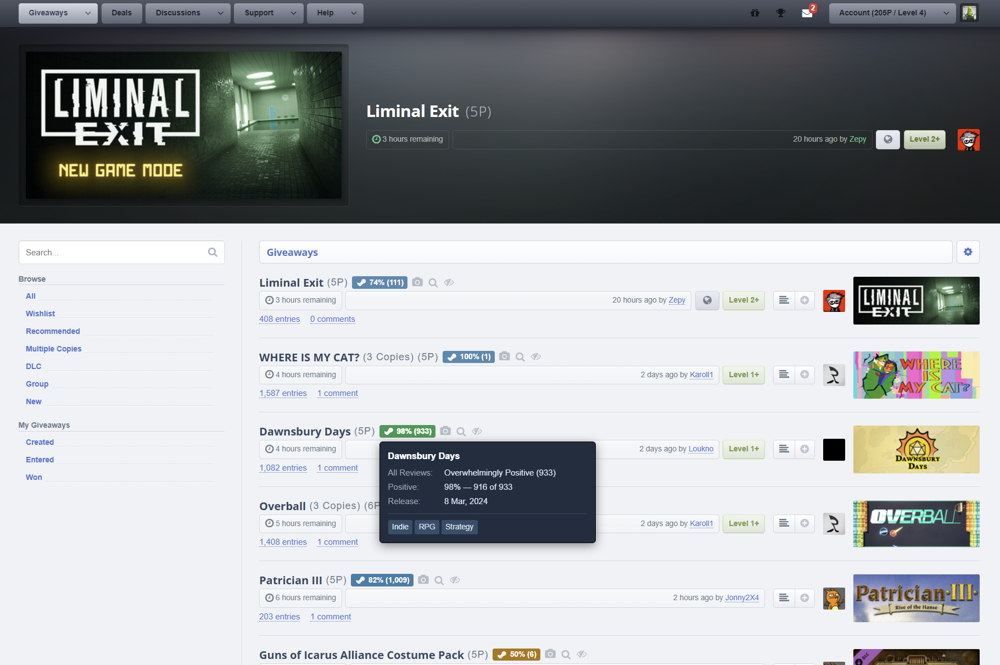

# SteamGifts – Steam Game Info (Ratings) Userscript

A userscript for [SteamGifts](https://www.steamgifts.com/) that replaces the small Steam store icon next to each game listing with a clickable rating badge, showing the game's review score, release date, and genres — without leaving the page.

## Features

- **Review score badge** — color-coded percentage + review count (e.g. `92% (14,302)`), pulled from Steam's review summary.
- **Hover tooltip** — all-reviews label, positive/total breakdown, release date, and genre tags.
- **Clickable** — the badge links straight to the game's Steam store page (opens in a new tab).
- **Cached** — results are cached locally for 30 days, so repeat visits don't re-hit Steam's API. Failed lookups (e.g. delisted or region-locked apps) are cached for 2 hours to avoid hammering Steam.
- **Rate-limited** — fetches run with limited concurrency and a small delay between requests, so it won't spam Steam or slow down page loads.
- **Works with dynamic content** — a `MutationObserver` picks up games added after the initial page load (e.g. AJAX-paginated listings).

## Installation

1. Install a userscript manager: [Tampermonkey](https://www.tampermonkey.net/) (recommended), [Violentmonkey](https://violentmonkey.github.io/), or [Greasemonkey](https://www.greasespot.net/).
2. **Chrome/Edge users — enable user scripts first** (see below), otherwise nothing will run.
3. [Click here to install](https://raw.githubusercontent.com/mcbyte-it/steamgifts-game-rating-reviews/main/sg-ratings.user.js) — your userscript manager will open an install prompt automatically.
   *(Or open [`sg-ratings.user.js`](sg-ratings.user.js) in this repo and copy/paste it into a new script.)*
4. Visit [steamgifts.com](https://www.steamgifts.com/) — badges appear automatically next to game listings.

### ⚠️ Chrome / Edge: you must enable user scripts

On Chromium-based browsers (Chrome, Edge, Brave, Opera), Manifest V3 blocks extensions from running unreviewed code by default. Until you flip this switch, your userscript manager will install scripts but **silently never execute them** — no badges, no errors.

Go to `chrome://extensions` → **Tampermonkey** (or **Violentmonkey**) → **Details**, and turn on:

> **Allow User Scripts** ☐
> *The extension will be able to run code which has not been reviewed by Google. It may be unsafe and you should only enable this if you know what you are doing.*

On older Chrome versions the equivalent is the **Developer mode** toggle in the top-right of `chrome://extensions`.

Firefox users can skip this — it doesn't apply.

## Configuration

A few constants near the top of the script can be tweaked directly:

| Constant | Default | Description |
|---|---|---|
| `CACHE_TTL` | 30 days | How long successful lookups are cached |
| `CACHE_TTL_FAIL` | 2 hours | How long failed lookups are cached before retrying |
| `CONCURRENCY` ⚠️ | 4 | Max simultaneous requests to Steam — don't increase this, Steam will start rate-limiting/blocking your IP |
| `REQ_DELAY` | 200ms | Delay between queued requests |
| `CC` / `LANG` | `us` / `english` | Steam store region/language used for release date & genre data |

## Managing the cache

Open your userscript manager's menu on any SteamGifts page and choose **"Clear Steam info cache"** to wipe all cached data and force fresh lookups.

## How it works

The script scans the page for links to `store.steampowered.com/app/<id>`, replaces the store icon with a loading badge, then queries two public Steam endpoints in parallel:

- `/appreviews/<id>` — review score summary
- `/api/appdetails` — release date & genres

Results are rendered into the badge and cached locally. A `MutationObserver` re-scans the page whenever SteamGifts loads more listings dynamically (e.g. infinite scroll/pagination).

## License

MIT — see [LICENSE](LICENSE).
